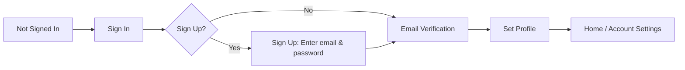

# Authentication Flow

Covers the step sequence from not signed in to active session.

## States
1. Not Signed In: Shows `Sign In` button.
2. **Sign In**: Enter credentials.
3. **Sign Up** (if chosen): Enter email & password.
4. **Email Verification**: Instruction text + Resend Verification Email.
7. **Set Profile**: Provide Name and Username.
8. Home / Account Settings: Authenticated.

## Resend Verification
- Button re-sends confirmation email using stored email.

## Sign Out
- Returns to Not Signed In.

## See Also
- [Account & Profile](account-profile.md)
- [Buy Products](buy-products.md)
