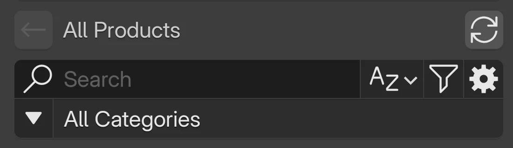

# Browse Assets

Find assets fast using search, filters, categories, sorting, and pagination.

- :material-magnify:{ .lg .middle } __Search__  
	Type text to live‑filter titles.

- :material-filter-menu:{ .lg .middle } __Filters__  
	Refine by price, type, subtype, ownership.

- :material-shape-outline:{ .lg .middle } __Categories__  
	Drill hierarchical taxonomy; combine with filters.

- :material-sort-alphabetical-variant:{ .lg .middle } __Sort__  
	Cycle presets (Newest ↔ Oldest, A–Z ↔ Z–A).

- :material-tab:{ .lg .middle } __Owned Tab__  
	View only assets you own.

- :material-page-next:{ .lg .middle } __Pagination__  
	Jump pages; edges disable controls.

## Interface Overview
{ width="45%" align=right }

| Element | Purpose |
| ------- | ------- |
| Search field | Filters asset titles as you type (case‑insensitive). |
| Sort button (A/Z icon) | Cycles through ordering presets. |
| Filters (:material-filter:) | Opens advanced filter popover. |
| Categories (:material-triangle-down:) | Opens hierarchical category browser. |
| Tabs (All / Owned) | Toggle global ownership scope. |
| Pagination bar | Navigate pages of results. |
| Browser settings (:material-cog:) | Adjust view and layout preferences of assets. |

!!! tip "Power combo"
    Combine :material-magnify: search + :material-filter-menu: filters + a category to aggressively narrow results.

!!! note "Live updates"
		Results list auto-updates immediately after most interactions—no separate "Apply" button.

## How To

=== "Basic Search"

    { width="55%" align=right }

    1. Focus the search field.
    2. Type a keyword (case‑insensitive).
    3. Observe filtered results update after typing stops briefly.

    !!! tip "Refine quickly"
          Short, distinctive substrings work best (e.g. `oak`, `snow`, `rock` instead of full phrases).

=== "Advanced Filters"

    1. Click the funnel icon :material-filter:.
    2. Adjust **Price Range** sliders to cap min/max.
    3. Choose **Product Type**: _All · Asset · Asset Pack_.
    4. (If Asset) pick **Asset Subtype** (Object · Texture · Heightmap).
    5. Toggle **Owned** to restrict to purchased assets.
    6. Close the popover; list refreshes automatically.

    !!! warning "Owned scope"
    	If no items appear after enabling **Owned**, you may not own any assets matching the other active filters.

=== "Browse Categories"

    { width="55%" align=right }

    1. Click the Categories triangle icon. :material-triangle-down:
    2. Click a category to drill deeper.
    3. Use **Browse All / Back** at the top to move up levels.
    4. Type in the category search box to narrow visible assets.
    5. Combine with search or filters for precision.

=== "Change Page"

    1. Click a page number to jump.
    2. Or use **Next / Previous**.
    3. Disabled buttons indicate start or end.

    !!! note "Why paginate?"
    	Pagination keeps memory usage low inside Blender and reduces initial load of heavy previews.

## Quick Reference

- :material-magnify: __Search__  
	Title substring match. No wildcards required.

- :material-filter-menu: __Filters__  
	Price, type, subtype, ownership.

- :material-shape-outline: __Categories__  
	Hierarchical drilldown; additive with filters.

- :material-sort-alphabetical-variant: __Sort Presets__  
	Newest · Oldest · A–Z · Z–A.

- :material-tab: __Owned Toggle__  
	Narrows scope to purchased assets.

- :material-page-next: __Pagination__  
	Navigate result pages.

!!! tip "Combine signals"
    Layering category + owned + short search term often reduces thousands of assets to a handful.

!!! info "Accessibility"
    All interactive controls expose textual labels or tooltips. Ensure high‑contrast theme selection if readability is reduced (palette toggle in header).

## Next Steps

- [:material-tag-multiple: Tags & Categories](tags-categories.md)  
	Deep dive on taxonomy usage.

- [:material-information-outline: Product Details](view-product-details.md)  
	Learn what each product panel reveals.

- [:material-cart: Buy Products](buy-products.md)  
	Purchasing workflow specifics.

- [:material-rocket-launch: Quick Start](quick-start.md)  
	Initial setup walkthrough.

??? note "Assumptions"
    Sort icon sequencing inferred from internal enum ordering.

## Troubleshooting {: #troubleshooting }
??? question "No results after filtering"
    Clear one dimension at a time (Owned toggle, then subtype, then price) to isolate the filter excluding everything.

??? question "Pagination jump feels slow"
    Large thumbnails or slow network can delay render; reduce page size or disable heavy previews in browser settings.

??? tip "Keyboard focus lost after search"
    Press <kbd>Tab</kbd> once to return focus to result grid for arrow navigation.