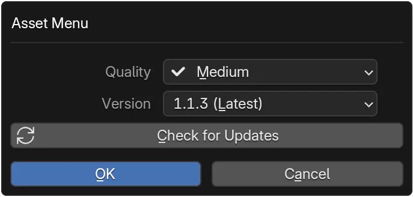

# Import Assets

Importing an asset downloads any missing files (first time) then links or creates the corresponding Blender data so you can place, assign, or edit it immediately.

-   :material-cube-outline:{ .lg .middle } __Object__

    ---

    Mesh / multi-object content: imports linked objects into the active collection.  
    [:octicons-arrow-right-24: Steps](#__tabbed_2_1)

-   :material-texture-box:{ .lg .middle } __Texture / Material__

    ---

    Builds a material, assigns to selected objects, mutes missing maps gracefully.  
    [:octicons-arrow-right-24: Steps](#__tabbed_2_2)

-   :material-terrain:{ .lg .middle } __Heightmap__

    ---

    Creates displaced plane with node network ready for sculpting or shading.  
    [:octicons-arrow-right-24: Steps](#__tabbed_2_3)

-   :material-help-circle:{ .lg .middle } __Troubleshoot__

    ---

    Slow downloads, missing textures, or update conflicts.  
    [:octicons-arrow-right-24: Fixes](#troubleshooting)

## At a Glance

=== "Comparison"
    | Type | Trigger | Creates / Updates | Placement Behavior | Notes |
    |------|---------|-------------------|--------------------|-------|
    | Object | Import button | Links objects / collections | Into active collection and places at cursor after click | Downloads missing data first |
    | Material | Import button | New material or updates existing node group | Assigns to currently selected objects | Missing maps muted |
    | Heightmap | Import button | Plane + displacement node setup | Places plane at origin | High-res meshes can be heavy |

=== "When to use which"
    - Use **Object** for geometry you want to place multiple times.
    - Use **Material** to standardize look across selected objects.
    - Use **Heightmap** for terrain prototyping or displacement-based workflows.

!!! info "Caching & re-use"
    Already downloaded assets are validated via checksum; re-import is near instantly unless you switched version/quality.

## Requirements
:octicons-check-circle-fill-16:{ .toggle_green } Asset owned.

:octicons-check-circle-fill-16:{ .toggle_green } Signed in for first download or if not cached.

:octicons-check-circle-fill-16:{ .toggle_green } Internet if asset not installed locally.

## Choose Version & Quality (optional) {: #choose-version-quality }

{ width="45%" align="right" }

1. Click the gear icon on the owned asset card. { width="30%" }
2. The dialog lists available Quality and Version options.
3. Select the desired version and quality.
4. (Optional) Click the `Check for Updates` button to refresh available builds.
5. Confirm to save the selection.

---

## Import Steps {: #import-steps }

The common import flows are grouped below — pick the tab for the asset type you're working with (or jump via the cards above).

=== "Object Assets"
    <figure>
        <video controls autoplay loop playsinline aria-label="Object asset import demonstration" title="Object asset import: download and place">
            <source src="/truevault/assets/videos/asset_obj_download_and_place.mp4" type="video/mp4">
            Your browser does not support the video element.
        </video>
        <figcaption>Object asset import — download and place.</figcaption>

    </figure>

    1. Click `Import` on the owned asset card.
    2. Sign in if prompted or allow the add-on to fetch identifiers.
    3. If the asset isn't cached it downloads while you choose placement.
    4. The objects link into the active collection.

=== "Texture Assets"
    <figure>
        <video width="50%" controls autoplay loop playsinline aria-label="Material asset import demonstration" title="Material asset import: download and place">
            <source src="/truevault/assets/videos/import_assets_material_example.mp4" type="video/mp4">
            Your browser does not support the video element.
        </video>
        <figcaption>Material asset import — download and assign.</figcaption>
    </figure>

    1. Select the target objects in Blender.
    2. Click `Import` on the material asset.
    3. A material is created (or updated) and assigned to the selected objects.
    4. Texture nodes are filled where files exist; missing maps are muted.

    !!! tip "Material slot behavior"
          Materials do not overwrite existing ones. They are inserted into new slots at the bottom of the material stack.

=== "Heightmap Assets"
    <figure>
        <video controls autoplay loop playsinline aria-label="Heightmap asset import demonstration" title="Heightmap asset import: download and place">
            <source src="/truevault/assets/videos/import_assets_heightmaps_example.mp4" type="video/mp4">
            Your browser does not support the video element.
        </video>
        <figcaption>Heightmap asset — imported plane with displacement setup.</figcaption>
    </figure>

    1. Click `Import`.
    2. After the download completes (if needed) a plane with a displacement setup is created for easy editing.

---

## Progress & Cancellation {: #progress }

!!! note "Download UI"
    A compact progress bar appears on the asset card while remote data transfers. If the bar vanishes too quickly it likely hit the local cache.

- Progress bar shows during download.
- Cancel button (X icon) or <kbd>ESC</kbd> stops download; import ends.
- On cancellation, partial files are cleaned up; cache remains consistent.

## After Import {: #after-import }
- You can re-import with different version/quality by changing settings then repeating.
- Re-importing an Object duplicates linked object instances; delete unwanted copies manually.
- Re-importing a Material updates the node tree (if structure unchanged) else creates a new suffixed material.
- Heightmap re-import spawns a fresh plane; consider using Collections to organize iterations.

## Troubleshooting {: #troubleshooting }

??? tip "Slow download"
    - Check other network usage; large textures or height maps can be >100MB.
    - Try importing a smaller asset to test baseline speed.
    - See [Offline & Caching](offline-caching.md) for cache location.

??? question "Missing textures after import"
    - Ensure all maps finished downloading (progress reached 100%).
    - Click import again (cached files will validate quickly).
    - Paths still broken? Restart Blender to rebuild search paths.

??? warning "Version mismatch"
    - If objects look wrong after switching version, re-open the Version & Quality dialog and confirm the intended build.
    - Clear local cache for that asset (if feature available) then re-import.

??? info "Material node differences"
    Some older asset versions may use legacy node groups; updating quality can migrate nodes. Always test in a duplicate file when upgrading large scenes.

## Next Steps

- :material-update:{ .lg .middle } __Manage Variants & Updates__

    ---

    Switch versions / qualities post-import.  
    [:octicons-arrow-right-24: Open](manage-variants-updates.md)

- :material-history:{ .lg .middle } __View Download History__

    ---

    Audit what you downloaded and when.  
    [:octicons-arrow-right-24: Review](view-download-history.md)

- :material-download:{ .lg .middle } __Offline & Caching__

    ---

    Learn cache location & offline behavior.  
    [:octicons-arrow-right-24: Guide](offline-caching.md)

