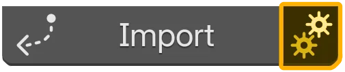

# Import Assets

Importing downloads (if needed) then adds data to the current Blender file.

## Requirements
- [x] Asset owned.
- [x] Signed in for first download or if not cached.
- [x] Internet if asset not installed locally.

## Choose Version & Quality (Optional) { width="50%"; align="right" }
1. Click the gear icon on the owned asset card.{ width="50%" }
2. Dialog lists Quality and Version.
3. Select desired options.
4. (Optional) Click Check for Updates.
5. Confirm to save selection.

---

<video class="float-media-right" controls autoplay muted loop playsinline src="/truevault/assets/videos/asset_obj_download_and_place.mp4" title="Object asset import: download and place"></video>
## Import Steps (Object Assets)
1. Click Import.
2. If prompted sign in or fetch identifiers.
3. Asset will begin to download (if not cached) while you find a place to put it.
4. Objects link into active collection.

 
 

---

<video class="float-media-right" controls autoplay muted loop playsinline src="/truevault/assets/videos/import_assets_material_example.mp4" title="Material asset import: download and place"></video>
## Import Steps (Texture Assets)
1. Select target objects.
2. Click Import.
3. Material is created/updated and assigned to selected objects.
4. Texture nodes filled where files exist; missing maps muted.
!!! Info
    Materials do not overwrite existing ones. It inserts it in new slots at the bottom

---

<video class="float-media-right" controls autoplay muted loop playsinline src="/truevault/assets/videos/import_assets_heightmaps_example.mp4" title="Heightmap asset import: download and place"></video>
## Import Steps (Heightmap Assets)
1. Click Import.
2. Once downloaded (if needed) a plane with a displacement setup is created for easy editing.

## Progress & Cancellation
- Progress bar shows during download.
- Cancel button (X icon) stops download; import ends.

## After Import
- You can re-import with different version/quality by changing settings then repeating.

## See Also
- [Manage Variants & Updates](manage-variants-updates.md)
- [View Download History](view-download-history.md)
- [Offline & Caching](offline-caching.md)
