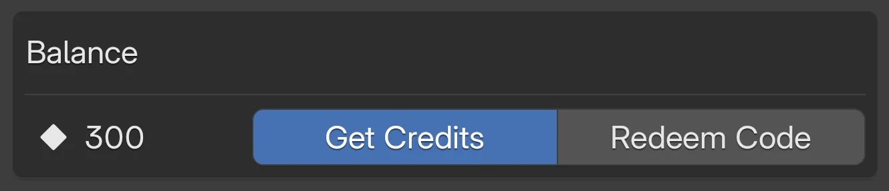
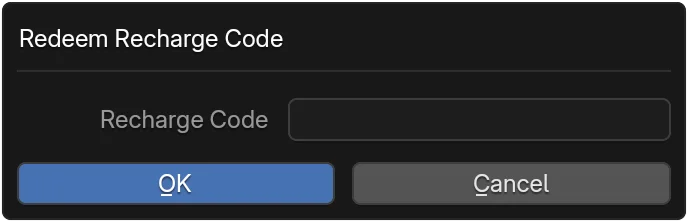

# Manage Credits
Credits are used to buy assets in the Asset Store. This guide shows multiple ways to add value (purchase vs redeem), how to read the balance UI, and how to resolve common issues fast.

-   :material-eye:{ .lg .middle } __Check Balance__

	---

	See remaining credits and color states (red = zero).  
	[:octicons-arrow-right-24: View](#view-balance)

-   :material-cart-plus:{ .lg .middle } __Get Credits__

	---

	Opens secure purchase page in your browser, then refresh panel.  
	[:octicons-arrow-right-24: Steps](#get-credits)

-   :material-gift:{ .lg .middle } __Redeem Code__

	---

	Apply promo / gift codes instantly in‑app.  
	[:octicons-arrow-right-24: How](#redeem-code)

-   :material-help-circle:{ .lg .middle } __Troubleshoot__

	---

	Codes failing or balance stuck? Quick fixes.  
	[:octicons-arrow-right-24: Help](#troubleshooting)

## At a Glance

=== "Purchase"

	Use when you want to add arbitrary amounts or bulk packs. Opens an **external** checkout in your default browser. After successful payment the app can refresh the panel to pull the updated balance.

	**Flow:** Panel → Get Credits → Browser Checkout → Return → Refresh.

=== "Redeem Code"

	Use when you have a pre-issued promo, gift, or compensation code. Stays fully in‑app (only a small dialog). Codes typically map to a fixed credit amount.

	**Flow:** Panel → Redeem Code → Enter + Submit → Balance updates.

!!! info "Balance refresh sources"
	The panel auto reloads on reopen or navigation. Manual **Refresh** forces an immediate API pull.

## View Balance
<figure markdown="span">
	{ width="420" }
	<figcaption>Asset Store panel: your credit balance and quick actions.</figcaption>
</figure>

1. In the Asset Store panel, look under **Balance**.
2. Icon + number shows current credits. The number highlights red when your balance is zero.

!!! tip "Color meanings"
	* Normal (default color): You have spendable credits.
	* :material-alert-circle-outline: Red highlight: balance is zero – consider purchasing or redeeming.

## Get Credits {: #get-credits }

1. Click the **Get Credits** button in the panel.
2. Your browser opens the credit purchase page (external).
3. Complete the purchase externally. Return to the app and click **Refresh** if the balance does not update.

!!! warning "Verify the purchase page domain"
	Ensure the browser opens the official TrueVFX payment domain (bookmark it). If something looks off, cancel and retry from inside the panel.

??? info "After purchase checklist"
	- [ ] Browser shows payment success / receipt.
	- [ ] Return to Blender, focus the Asset Store panel.
	- [ ] Click **Refresh** (or reopen panel) if credits not visible within ~10s.
	- [ ] Still missing? See [Troubleshooting](#troubleshooting).

## Redeem Code {: #redeem-code }

<figure markdown="span">
	{ width="420" }
	<figcaption>Redeem code dialog and recharge UI.</figcaption>
</figure>

1. Click **Redeem Code**.
2. Enter the code into the dialog and submit.
3. Balance updates on success; if it doesn't, try **Refresh**.

??? example "Example outcomes"
	=== "Success"
		> :material-check-circle-outline: **Applied** – `+150` credits added.

		Balance increments immediately (UI flashes then settles). No further action needed.

	=== "Failure"
		> :material-close-circle-outline: **Invalid or expired code**.

		Re‑type carefully (avoid trailing spaces). If you copied from email, check no hidden characters.

??? tip "When codes don't apply"
	- Verify the code has not expired and is entered exactly (no extra spaces).
	- Promotional codes may be region- or account-restricted.
	- Some codes are single‑use per account – previously used codes silently fail.
	- Wait 30–60s then retry if network latency is high.

## Troubleshooting {: #troubleshooting }

- Balance updates automatically on panel reload or after purchases.
- Use the **Refresh** (Reload) button if the number seems stale.
- If a successful purchase doesn't reflect after 1 minute, log out/in or restart Blender (forces auth + sync).
- Persistent mismatch? Capture the purchase receipt ID and contact support (include timestamp & account email).
- For repeated failed code attempts, stop after 3 tries to avoid temporary rate limiting.

## Next Steps

- :material-cart:{ .lg .middle } __Buy Products__

	---

	Purchase assets using your credits.  
	[:octicons-arrow-right-24: Purchase Flow](buy-products.md)

- :material-cash-refund:{ .lg .middle } __Refund a Purchase__

	---

	Resolve mistaken or failed purchases.  
	[:octicons-arrow-right-24: Refund Guide](refund-purchase.md)

