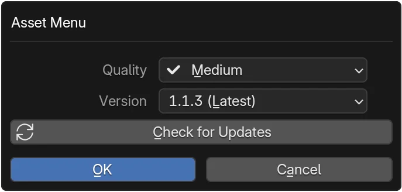

# Manage Variants & Updates

Control which variant of an asset you import.

## At a Glance

- :material-tune:{ .lg .middle } __Open Dialog__  
  Access variant controls.  
  [:octicons-arrow-right-24: Open](#open-variant-dialog)

- :material-image-size-select-large:{ .lg .middle } __Quality__  
  Resolution / data size.  
  [:octicons-arrow-right-24: Quality](#select-quality)

- :material-update:{ .lg .middle } __Version__  
  Pick compatible release.  
  [:octicons-arrow-right-24: Version](#select-version)

- :material-refresh:{ .lg .middle } __Check Updates__  
  Refresh list for new.  
  [:octicons-arrow-right-24: Updates](#check-for-updates)

- :material-content-save:{ .lg .middle } __Persist Choice__  
  Saves for next import.  
  [:octicons-arrow-right-24: Persist](#persisted-choice)

- :material-history:{ .lg .middle } __History__  
  See previous downloads.  
  [:octicons-arrow-right-24: History](view-download-history.md)

## Open Variant Dialog { align="right"; width=50% }
1. Owned asset card: click Settings (:fontawesome-solid-gears:) below title (or via Import row).
2. Dialog shows `Quality` and `Version` dropdowns.

## Select Quality
- Choose resolution or data size option.
- Description may include file size.

## Select Version
- Defaults to latest compatible version.
- Pick another if older compatibility required.

## Check for Updates
1. In the dialog click `Check for Updates`.
2. If an update found, version list may change.
3. Re-select desired version if needed and confirm.

## Persisted Choice
- Your selection saves locally and applies to next Import.

## Troubleshooting {: #troubleshooting }
??? question "New version not appearing?"
    * Click **Check for Updates** again.  
    * Verify network connectivity.  
    * Asset may not have newer compatible release.

??? question "Import still using old quality?"
    * Re-open dialog to confirm saved selection.  
    * Clear local cache for asset then re-import.

??? question "Version list empty?"
    * Ownership may have lapsed / not recognized—re-authenticate.  
    * Check Console for API errors.

## Next Steps

- :material-import: __Import Assets__  
  Download & place assets.  
  [:octicons-arrow-right-24: Import](import-assets.md)

- :material-history: __Download History__  
  Audit what was fetched.  
  [:octicons-arrow-right-24: History](view-download-history.md)

- :material-cash: __Manage Credits__  
  Ensure you can fetch updates.  
  [:octicons-arrow-right-24: Credits](manage-credits.md)

