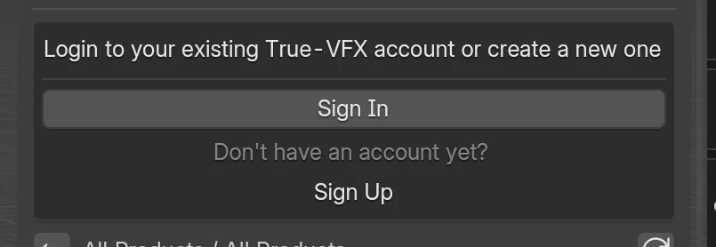
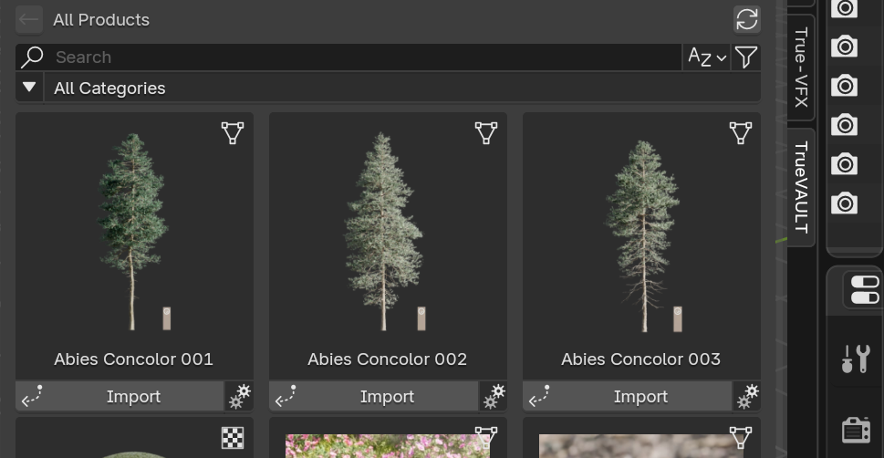
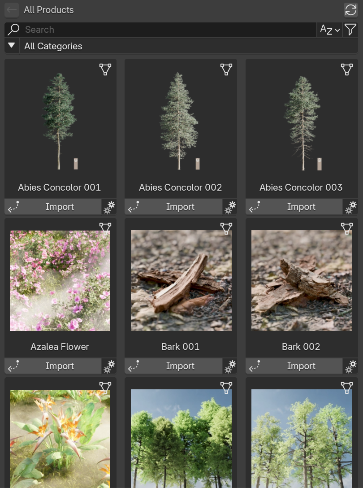
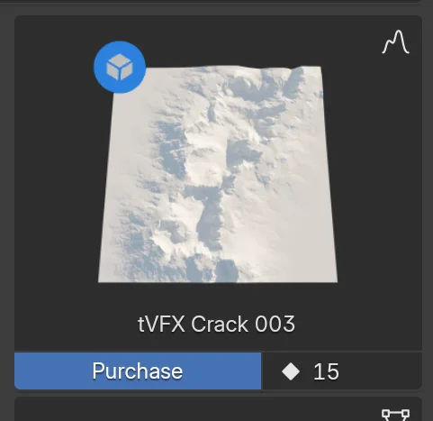
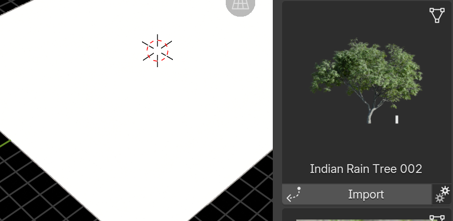

# Quick Start

Get productive in under 5 minutes.

!!! tip "TL;DR – Fast Path"
    

        

            <a class="md-button md-button--primary truevault-drag-button" draggable="true" ondragstart="handleDragStart(event)">
                :material-download: Drag & Drop into Blender
            </a>
        

    

    
    1. Drag the above button into Blender and run through the prompts.
    2. Enable TrueVAULT in `Edit > Preferences > Get Extensions` or `Edit > Preferences > Add-ons`.
    3. Sign in / Sign Up through the addon Preferences or side panel (<kbd>N</kbd> key → `TrueVAULT` tab).
    4. Link SuperHive Purchases :octicons-arrow-right-24: [https://api.true-vfx.xyz/](https://api.true-vfx.xyz/)
    5. Search, purchase (if needed), Import.
    6. Done – asset appears in your scene / materials list.

---

## At a Glance

-   :material-download:{ .lg .middle } __Install__

    ---

    Drag & drop or manual ZIP install.  
    [:octicons-arrow-right-24: Steps](#1-install-the-add-on)

-   :material-view-dashboard-outline:{ .lg .middle } __Open Panel__

    ---

    Sidebar <kbd>N</kbd> → TrueVAULT tab.  
    [:octicons-arrow-right-24: Panel](#2-open-the-panel)

-   :material-account-key:{ .lg .middle } __Sign In__

    ---

    Authenticate / verify email / MFA.  
    [:octicons-arrow-right-24: Auth](#3-sign-in-create-account)

-   :material-database-search:{ .lg .middle } __Browse & Details__

    ---

    Search, filter, open product pages.  
    [:octicons-arrow-right-24: Browse](#4-browse)

-   :material-cart:{ .lg .middle } __Purchase__

    ---

    Use credits or redeem code.  
    [:octicons-arrow-right-24: Purchase](#6-purchase-if-not-owned)

-   :material-import:{ .lg .middle } __Import & Verify__

    ---

    Download, place, confirm result.  
    [:octicons-arrow-right-24: Import](#7-import)

## 1. Install the Add-on

Choose a method below.

=== "Drag & Drop (Recommended)"

       

           

               <a class="md-button md-button--primary truevault-drag-button" draggable="true" ondragstart="handleDragStart(event)">
                   :material-download: Drag & Drop into Blender
               </a>
           

       

       1. Drag the blue button above into the Blender window.
       2. Accept the install prompt.
          1. We recommend enabling "Check for Updates on Startup", but it is not required.
          2. You can also tell Blender where to put the addon using the "Custom Directory" toggle and path input field.
          3. We do not require an access token for this repository.
       4. Enable TrueVAULT in either the `Edit > Preferences > Get Extensions` or `Edit > Preferences > Add-ons`.
       5. Sign in / Sign Up through the addon preferences or the side panel (<kbd>N</kbd> key) → `TrueVAULT` tab.
       6. Link SuperHive Purchases :octicons-arrow-right-24: [https://api.true-vfx.xyz/](https://api.true-vfx.xyz/)
          1. This allows access to your purchased assets made through SuperHive.
          2. Only assets are available for linking at this time. Addon purchases will come in the future.
       7. Search, purchase (if needed), Import.
       8. Done – asset appears in your scene / materials list.

=== "Manual"

     1. Open Preferences (CTRL + ,)
     2. Go to the `Get Extensions` tab.
     3. Open the `Repositories` dropdown in the top left.
     4. Click the + button then "Add Remote Repository".
     5. Enter the repository URL: `https://vault.true-vfx.xyz/functions/v1/get-repo`.
        1. We recommend enabling "Check for Updates on Startup", but it is not required.
        2. You can also tell Blender where to put the addon using the "Custom Directory" toggle and path input field.
        3. We do not require an access token for this repository.
     6. Search for TrueVAULT if necessary and enable
     7. Sign in / Sign Up through the addon preferences or the side panel (<kbd>N</kbd> key) → `TrueVAULT` tab.
     8. Link SuperHive Purchases :octicons-arrow-right-24: [https://api.true-vfx.xyz/](https://api.true-vfx.xyz/)
     9. Search, purchase (if needed), Import.
     10.  Done – asset appears in your scene / materials list.

=== "Updating"

       * Preferred: `Edit > Preferences > Get Extensions` → Installed tab → if an update badge appears on **TrueVAULT**, click :material-refresh: Update (or enable the global Auto-Update toggle so future versions install automatically).  
       * If Auto-Update is enabled you just need to restart Blender when prompted (or the add-on hot-reloads).  
       * Manual fallback: re-drag-and-drop the extension and install again (Blender will overwrite).
       * Existing local cached assets remain unless you clear them.

<!-- === "Manual (Zip File)"

       1. Click the link to download: [Download latest add-on ZIP](https://github.com/True-VFX/true_vault/releases/latest){ .md-button }  
       2. Blender: `Edit > Preferences > Add-ons > Install...`  
       3. Select the downloaded `true_vault.zip`.  
       4. Enable the checkbox.  
       5. (Optional) Adjust Library Path. -->

---

## 2. Open the Panel
1. In a 3D View press <kbd>N</kbd> to open the Sidebar.
2. Click the `TrueVAULT` tab.

## 3. Sign In / Create Account { width="50%" align=right }
You will see Sign In prompts if not authenticated.

1. Click `Sign In`.
2. Enter email and password.
3. Complete email verification if prompted.
4. Set Name and Username in the Account Settings.

## 4. Browse

- Use the Search field (:octicons-search-16:) to find assets.
{ width="50%" align=right }
- Open Filters (:material-filter:) for sort, price range, type, owned.
- Open Categories (:material-triangle-down:) to drill down by category path.

## 5. View Details
1. Click a product title on its card.
{ width="25%" align=right }
2. Explore gallery arrows :octicons-triangle-left-24: / :octicons-triangle-right-24: or dots :octicons-dot-fill-24: to cycle images.
3. Review Tags and License information.

## 6. Purchase (If Not Owned)
1. Click Purchase.
{ width="25%" align=right }
2. Dialog shows credit price and your balance.
3. If insufficient credits, click Recharge (opens web page) or Redeem Code.
4. Confirm Purchase. Success message appears.

## 7. Import
1. Owned asset shows an Import button.
{ width="50%" align=right }
2. Optionally click the gear icon to choose Version & Quality :fontawesome-solid-gears:.
3. Click Import.
4. Placement:
      - **Objects**: Click in the viewport to place.
      - **Textures**: select objects first to auto-apply material.
      - **Heightmaps**: a geometry nodes setup is created.
5. Wait for download progress (press <kbd>ESC</kbd> to Cancel).

## 8. Verify
- Imported objects appear in the active collection.
- Materials appear in the Material list if texture asset.
- Heightmap object with Geometry Nodes modifier if heightmap asset.

---

## Troubleshooting {: #troubleshooting }

??? question "Can't see the TrueVAULT tab?"
    * Ensure the add-on is enabled in Preferences.  
    * Try toggling it off/on.  
    * Check Console for errors (`Window > Toggle System Console`).

??? question "Drag & Drop install not working?"
    * Use the Manual (Zip File) tab above.  
    * Verify Blender version ≥ target: **{{ page.meta.blender_version_target }}**.

??? question "Import stalled at 0%?"
    * Check internet connection / firewall.  
    * Re‑sign in if token expired (look for auth prompt).  
    * Use smaller quality variant via gear icon :fontawesome-solid-gears:.

---

## Next Steps

- :material-magnify: __Browse Assets__  
    Learn powerful filtering & categories.  
    [:octicons-arrow-right-24: Browse](browse-assets.md)

- :material-cart: __Purchase Flow__  
    Credits, recharging & redeem codes.  
    [:octicons-arrow-right-24: Buy](buy-products.md)

- :material-download: __Import Options__  
    Variants, qualities & placement tips.  
    [:octicons-arrow-right-24: Import](import-assets.md)

- :material-cash: __Manage Credits__  
    Track balance & spending.  
    [:octicons-arrow-right-24: Credits](manage-credits.md)

