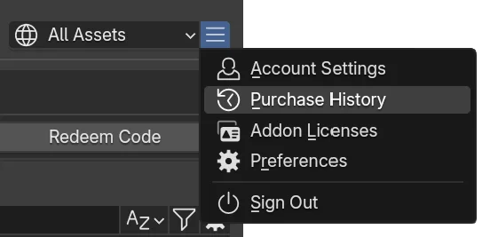

# Refund a Purchase

Request a refund for qualifying purchases.

> **Need the detailed rules?** See the full [Refund Policy](../reference/refund-policy.md) for eligibility, download thresholds, and calculation examples.

## Requirements
- Purchase status is Completed.
- Within allowed refund policy window (30 days).

## Steps { width=50%; align=right }
1. Open `Purchase History` (Menu :material-menu: > Purchase History).
2. Find the purchase entry.
3. Open its menu :material-menu:.
4. Click `Refund Product`.
5. Confirm any dialog prompts.

## Result
- Credits returned or adjusted (depends on server response).
- Product ownership may revoke if applicable.

## See Also
- [Buy Products](buy-products.md)
- [Manage Credits](manage-credits.md)
- [Refund Policy](/docs/reference/refund-policy/)
- [Refund Policy](../reference/refund-policy.md)
