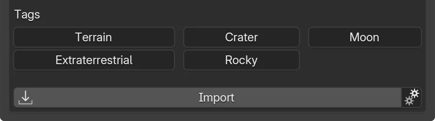

# Use Tags & Categories

Combine categories and tags to refine large libraries.

## At a Glance

- :material-folder-multiple:{ .lg .middle } __Browse Tree__  
  Drill into hierarchy.  
  [:octicons-arrow-right-24: Categories](#categories)

- :material-filter:{ .lg .middle } __Quick Search__  
  Filter visible nodes.  
  [:octicons-arrow-right-24: Search](#categories)

- :material-tag-multiple:{ .lg .middle } __Tag Chips__  
  Click to pivot list.  
  [:octicons-arrow-right-24: Tags](#tags)

- :material-compass:{ .lg .middle } __Path Breadcrumb__  
  Shows current chain.  
  [:octicons-arrow-right-24: Categories](#categories)

- :material-history:{ .lg .middle } __Back / Browse All__  
  Navigate upward.  
  [:octicons-arrow-right-24: Categories](#categories)

- :material-magnify:{ .lg .middle } __Combined Filters__  
  Use with search & type.  
  [:octicons-arrow-right-24: Browse](browse-assets.md)

## Categories { width=50%; align=right }
1. Open Categories popover :material-triangle-down:.
2. Click a category to drill deeper.
3. Use `Browse All` / `Back` entry to go up.
4. Path summary shows current chain.
5. Type in the search box to filter visible categories (case-insensitive).

## Tags { width=50%; align=right }
1. Open a [product details](view-product-details.md) page.
2. Click a tag chip.
3. Browser reloads filtered by that tag.

## Troubleshooting {: #troubleshooting }
??? question "Category list empty?"
    * No categories for current filter scope.  
    * Clear other filters (Owned / Type).  
    * Check connectivity.

??? question "Tag click does nothing?"
    * Tag may map to zero results—check filter bar.  
    * Re-open details page and retry.

??? question "Wrong category path shown?"
    * Refresh product metadata.  
    * Category taxonomy may have updated.

## Next Steps

- :material-database-search: __Browse Assets__  
  Full filtering overview.  
  [:octicons-arrow-right-24: Browse](browse-assets.md)

- :material-view-gallery: __View Product Details__  
  Explore tags in context.  
  [:octicons-arrow-right-24: Details](view-product-details.md)

- :material-layers-triple: __Variants & Updates__  
  Manage import choices.  
  [:octicons-arrow-right-24: Variants](manage-variants-updates.md)

