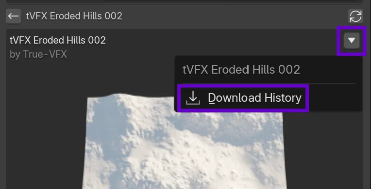

# View Download History

Check versions and qualities you have downloaded.

## At a Glance

- :material-menu:{ .lg .middle } __Open Menu__  
  Access history view.  
  [:octicons-arrow-right-24: Open](#from-asset-details)

- :material-history:{ .lg .middle } __Entries__  
  Version + quality + date.  
  [:octicons-arrow-right-24: Details](#history-entries)

- :material-eye-off:{ .lg .middle } __Empty State__  
  Not downloaded yet prompt.  
  [:octicons-arrow-right-24: Empty](#when-empty)

- :material-layers-triple:{ .lg .middle } __Variants Link__  
  Manage selected version.  
  [:octicons-arrow-right-24: Variants](manage-variants-updates.md)

- :material-import:{ .lg .middle } __Re-Import__  
  Use previous quality quickly.  
  [:octicons-arrow-right-24: Import](import-assets.md)

- :material-refresh:{ .lg .middle } __Refresh**  
  Update after downloads.  
  [:octicons-arrow-right-24: Refresh](#from-asset-details)

## From Asset Details { align="right"; width=50% }
1. Owned asset: locate menu button (:material-triangle-down:).
2. Click `Download History`.
3. Panel switches to history view.

## History Entries
- Date/time of download (formatted date).
- Quality title.
- Version title.

## When Empty
- Shows "Not downloaded yet." message.

## Troubleshooting {: #troubleshooting }
??? question "History not updating?"
    * Re-open the asset menu to refresh.  
    * Confirm the download fully completed.  
    * Check network connectivity.

??? question "Wrong version shown?"
    * Clear variant selection and re-open dialog.  
    * A newer version may have replaced prior selection.

??? question "Missing older entries?"
    * Local history pruning may occur (limit).  
    * Re-download to repopulate with current version.

## Next Steps

- :material-layers-triple: __Variants & Updates__  
  Choose versions & qualities.  
  [:octicons-arrow-right-24: Variants](manage-variants-updates.md)

- :material-import: __Import Assets__  
  Bring assets into scene.  
  [:octicons-arrow-right-24: Import](import-assets.md)

- :material-cash: __Manage Credits__  
  Ensure balance for downloads.  
  [:octicons-arrow-right-24: Credits](manage-credits.md)

