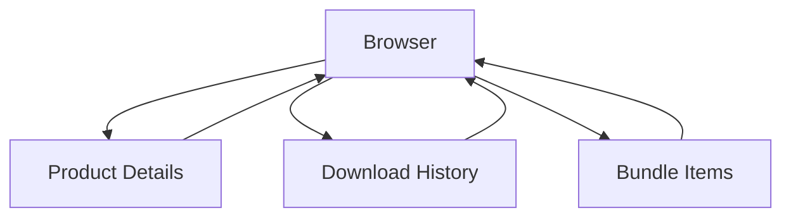

# Flows & States

## Browsing State Machine

*Diagram: High-level navigation states.*

| State | Triggers | Exit Actions | Notes |
|-------|----------|--------------|-------|
| browser | Opening panel, Back actions | None | Shows grid & pagination |
| product_details | View Product Details operator | Back / Import / Tag click | Shows gallery & sections |
| download_history | View Download History | Back | Lists past downloads |
| bundle_items | View Bundle Items | Back | Shows items of a bundle |

## Auth Flow
| Step | Purpose | Transition Trigger | Side Effect |
|------|---------|--------------------|-------------|
| NOT_SIGNED_IN | Prompt sign in | Sign In | Begin credential input |
| SIGN_IN / SIGN_UP | Credentials entry | Submit | Session attempt |
| VERIFY_EMAIL | Confirm email | Link clicked (external) | Next step chosen |
| ADD_PHONE | Provide phone | Submit number | MFA path |
| VERIFY_MFA | Enter code | Code valid | MFA complete |
| SET_PROFILE | Name & username | Submit | Profile stored |
| HOME/ACCOUNT_SETTINGS | Authenticated hub | Sign Out | Return to NOT_SIGNED_IN |

## Purchase Flow
| Phase | Action | Result |
|-------|--------|--------|
| Select | Click Purchase | Dialog opens |
| Validate Balance | Compare price vs balance | Choose confirm or recharge |
| Confirm | Click Confirm Purchase | Server processes |
| Post | Success | Ownership + balance update |

## Import Flow
| Phase | Action | Result |
|-------|--------|--------|
| Prepare | Click Import | Modal begins |
| Identify | Fetch version/quality if missing | IDs resolved |
| Download | Download asset if absent | Local zip ready |
| Place | (Objects) Click viewport | Location set |
| Integrate | Unpack & link data | Scene updated |
| Finish | Cleanup timers | Ready for re-import |

## See Also
- [Operators](operators.md)
- [Properties & Filters](properties-filters.md)
